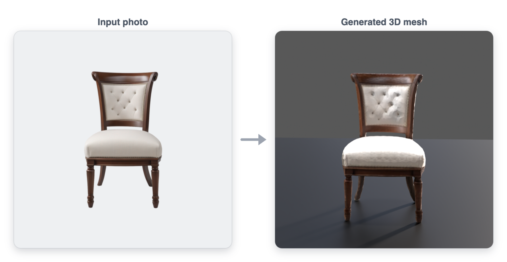

# SF3D WebGPU

Single-image 3D mesh generation running entirely in WebGPU compute shaders. A browser port of Stability AI's [Stable Fast 3D](https://github.com/Stability-AI/stable-fast-3d).

No server, no Python, no ONNX at inference time. Image in, textured GLB out.



*A single photo becomes a textured, UV-unwrapped GLB in ~33s on an M4 Max — generated entirely by WebGPU compute shaders in the browser. Output above is the bundled `demo_chair.png` example.*

## Quick Start

```bash
# 1. Install JS dependencies
npm install

# 2. Download the model weights (~2.1 GB) into public/
hf download BasinShapers/sf3d-webgpu-weights weights.bin --local-dir public/

# 3. Run
npm run dev            # or: npx vite --port 5177
# Open http://localhost:5177/
# Click "Try Demo (Chair)" or drop any image
# Click "Generate 3D Mesh" (~25-35s on M4 Max)
# Click "Download GLB"
```

### Model weights

Inference needs `public/weights.bin` — a ~2.1 GB fp16 flat binary (gitignored,
never committed). The quickest path is the pre-converted download above from
[`BasinShapers/sf3d-webgpu-weights`](https://huggingface.co/BasinShapers/sf3d-webgpu-weights)
(needs the [`hf` CLI](https://huggingface.co/docs/huggingface_hub/guides/cli):
`pip install -U huggingface_hub`).

**Or build it yourself** from Stability AI's original checkpoint with
`tools/convert_weights.py`, which requires:

- **PyTorch** and the [`stable-fast-3d`](https://github.com/Stability-AI/stable-fast-3d)
  package importable on `PYTHONPATH` (the converter imports `sf3d.system`; point
  it at a checkout with `SF3D_REPO=/path/to/stable-fast-3d`).
- **HuggingFace access** to the gated
  [`stabilityai/stable-fast-3d`](https://huggingface.co/stabilityai/stable-fast-3d)
  model — accept its license and authenticate (`huggingface-cli login`), then:

  ```bash
  python tools/convert_weights.py --output public/weights.bin --dtype fp16
  ```

  Pass `--model-path /local/checkout` to convert from a local copy instead of
  downloading.

Both the hosted weights and the original model are governed by the
[Stability AI Community License](https://huggingface.co/BasinShapers/sf3d-webgpu-weights/blob/main/LICENSE.md)
(free for research, non-commercial, and commercial use under US $1M annual
revenue). **Powered by Stability AI.**

## Production Build

```bash
npm run build
```

Production builds preserve the application and non-model files from `public/`,
but intentionally omit `public/weights.bin` from `dist/`. Deployments must mount
or stage that model file separately at `/weights.bin`; an ordinary local build
must not create another multi-gigabyte copy.

## Smoke Test

```bash
node tools/smoke_inference.mjs --image public/demo_chair.png
```

Produces `/tmp/sf3d-inference-smoke.glb` and a report at `/tmp/sf3d-inference-smoke-report.txt`. Previous smoke outputs are versioned in `/tmp/sf3d-smokes/` for A/B comparison.

To regenerate the README imagery from a GLB:

```bash
node tools/render_glb_hero.mjs --glb /tmp/sf3d-inference-smoke.glb --out docs/assets/hero-chair.png
node tools/compose_before_after.mjs --input public/demo_chair.png \
  --render docs/assets/hero-chair.png --out docs/assets/hero-before-after.png
```

## Pipeline

| Stage | Module | Runs on |
|-------|--------|---------|
| Image preprocessing | `inference.js` | CPU |
| Camera embedding | `inference.js` | GPU |
| DINOv2 ViT-Large backbone | `sf3d_backbone.js` | GPU |
| Two-stream interleave transformer | `two_stream.js` | GPU |
| PixelShuffle post-processor | `post_processor.js` | GPU |
| Triplane query + MaterialMLP decoder | `triplane_decoder.js` | GPU |
| Marching tetrahedra | `marching_tet.js` | CPU |
| UV unwrap (PCA + cube projection + BVH overlap) | `texture_baker.js` | CPU |
| Texture bake (triplane query per texel) | `texture_baker.js` | GPU |
| GLB export | `texture_baker.js` | CPU |

14 WGSL compute shaders (shared from MOGE port) + 5 inline shaders in `triplane_decoder.js`.

## Numerical Match to PyTorch

Measured against the original PyTorch pipeline on the bundled `demo_chair.png`:

- Vertex count: 9988 vs 10008 (99.8%)
- Density at known inside vertices: within 4%
- SDF max: 28.34 vs 28.58
- Textured output matches the PyTorch reference render under side-by-side visual inspection
- Remaining gap is fp16 precision + Lanczos resize interpolation difference

### Deterministic output receipt

The final GLB is **bit-for-bit reproducible**. A clean `npm install` → convert
weights → run produces, for `demo_chair.png`:

```
SHA-256(demo_chair GLB) = e1f70de3407df24d571bf68f70fac2b59373bdd948075a2387f1834e4faff8b7
9988 vertices · 19976 faces · ~33s end-to-end (M4 Max)
```

The same hash is emitted by both scheduling paths (monolithic and
arena-plus-worker) across the A/B/C/D product harness — the output is
independent of GPU-duty scheduling. The cooperative post-processor also passes
[`@kaminos/webgpu-inference-kit`](https://github.com/lyonsno/kaminos)'s
`validateWebGpuCooperativeExecutionReport` against the exact 702-duty
bounded-prefix contract. Receipts are versioned under
[`smoke-receipts/`](smoke-receipts/).

## Architecture

```
src/
  lib/
    inference.js          Pipeline orchestration, preprocessing, camera embed
    sf3d_backbone.js      DINOv2 ViT-Large with AdaNorm modulation
    two_stream.js         TwoStreamInterleaveTransformer backbone
    post_processor.js     PixelShuffle post-processor
    triplane_decoder.js   Triplane query + MaterialMLP decoder
    marching_tet.js       CPU marching tetrahedra mesh extraction
    texture_baker.js      UV unwrap, rasterize, bake albedo+normal, GLB export
    weights.js            Weight file loader with tensor name mapping
    gpu.js                WebGPU initialization + buffer helpers
    shader_ops.js         Shared shader dispatch helpers
  main.js                 Browser UI wiring
  shaders/                WGSL compute shaders
tools/
  convert_weights.py      PyTorch -> flat binary fp16 weight converter
  smoke_inference.mjs     Puppeteer-driven browser smoke test
  render_glb_hero.mjs     Render a GLB to a hero still (model-viewer)
  compose_before_after.mjs  Compose input-photo / generated-mesh banner
  compare_density.py      PyTorch reference density comparison
  evidence/               Durable smoke artifacts
public/
  tets/                   Marching tetrahedra grid data
  demo_chair.png          Demo input image
```

## UV Unwrap Pipeline

The texture baker implements SF3D's cube-projection UV unwrapper with:

1. **PCA alignment** — rotates vertex positions so principal axes align with canonical X/Y/Z (Jacobi eigendecomposition, matching PyTorch `_align_mesh_with_main_axis`)
2. **Cube projection** — assigns faces to 6 cube faces by normal direction, projects matching PyTorch axis conventions
3. **Tangent-aligned UV rotation** — rotates UVs per cube face to align with canonical tangent direction (matching PyTorch `_rotate_uv_slices_consistent_space`)
4. **BVH overlap detection** — triangle-triangle intersection via Sutherland-Hodgman polygon clipping with area threshold, replacing initial grid-based approach
5. **Three-tier atlas packing** — primary (3x2 grid), secondary (3x2 half-size), remaining (per-face sub-cells)
6. **Conditional sub-texel coverage** — fills unoccupied texels for sub-texel faces without overwriting correctly-rasterized data

## Development History

| Session | Date | Key deliverables |
|---------|------|-----------------|
| 1 | 2026-06-27 | MPS bring-up, initial scaffold, DINOv2+backbone dispatch, weight converter |
| 2 | 2026-06-28 | End-to-end pipeline, 6 bug fixes, coherent mesh, first full visual validation |
| 3 | 2026-06-29 | Texture baking, normal maps, smooth normals, GLB export, 2 reviews |
| 4 | 2026-06-30 | UV atlas splitting: bbox normalization, overlap detection, sub-texel fixes |
| 5 | 2026-07-01 | Tangent UV rotation, PyTorch-matching axes, PCA alignment, BVH overlap detection, visual parity |
| 6–11 | 2026-07 | Cooperative WebGPU execution: DINO/two-stream/post-processor duty decomposition, scratch-arena + worker offload, bounded-prefix scheduling, `@kaminos/webgpu-inference-kit` conformance, byte-identical output across scheduling paths |

## License

This is a port of [Stability AI's Stable Fast 3D](https://github.com/Stability-AI/stable-fast-3d) for research and educational purposes. See the original repository for license terms.
